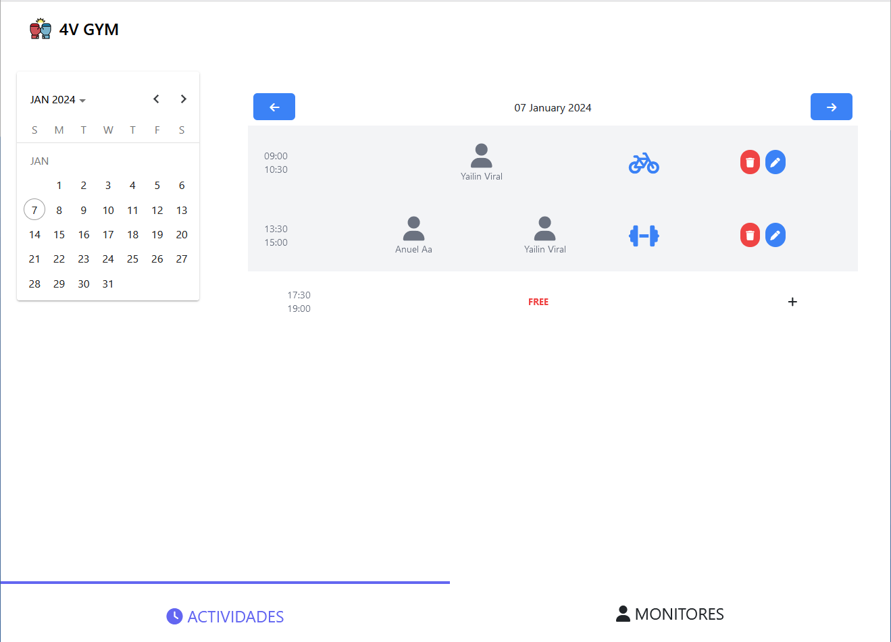
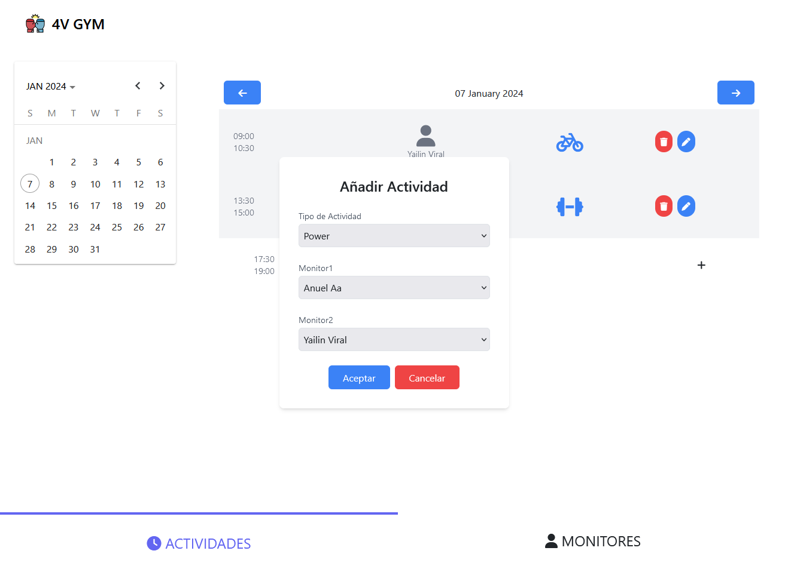
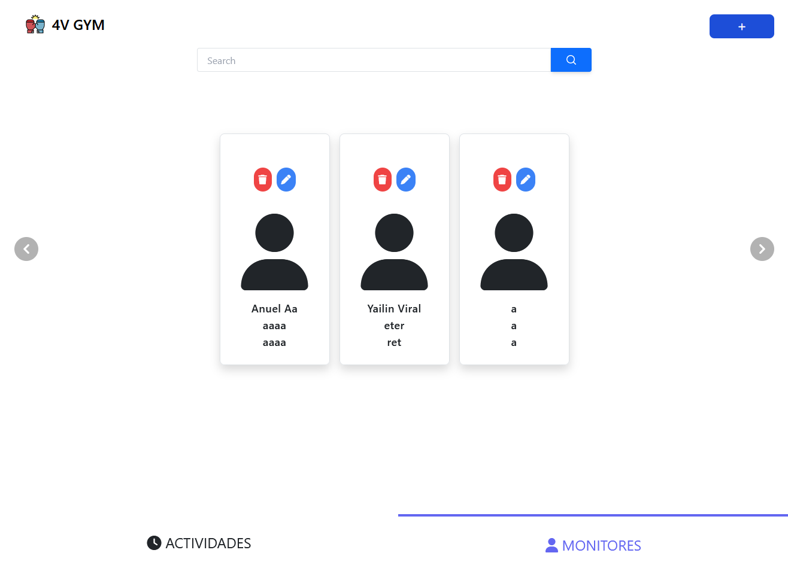
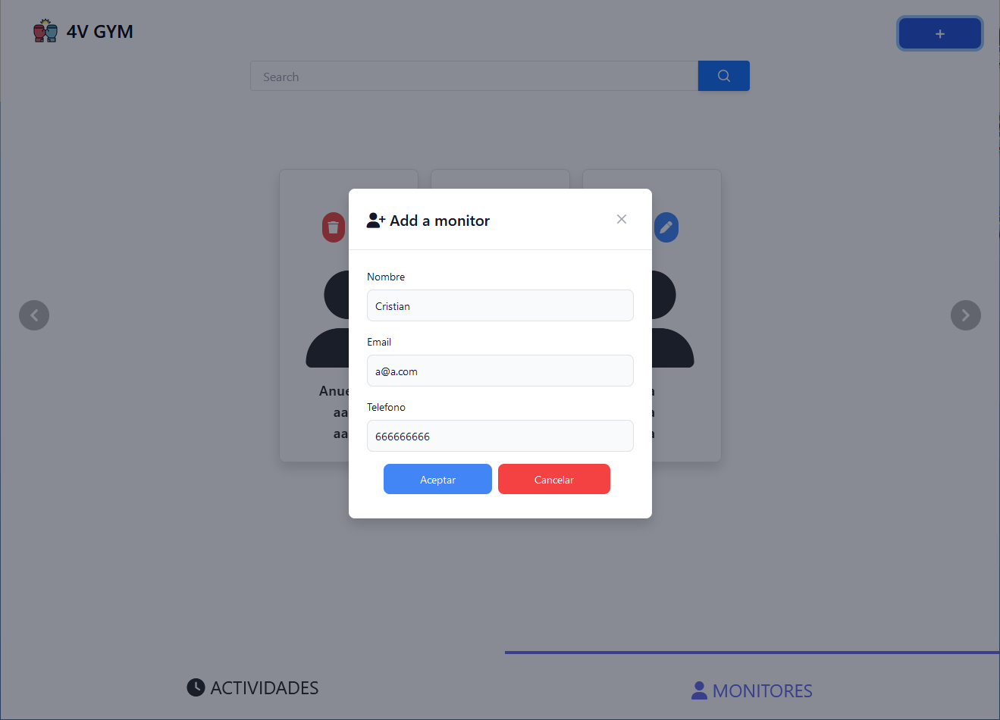

# Gym Interface Manager

## Description

This interface development application is designed to manage monitors and activities in a gym. The main objective of this practice is to faithfully implement the interface according to the provided design, even if it appears unattractive. Additionally, the goal is to create reusable components to enhance system modularity.

## Key Features

- **Header and Logo:**
  - The page always includes a header with the gym's name and logo.

- **Function Selector:**
  - At the bottom, there is a function selector allowing users to choose between "Activities" and "Monitors."

## Activities Page
  

- **Date Selector:**
  - Users can choose a date and navigate between different dates.

- **Activity Blocks:**
  - Each day displays three fixed activity blocks.

- **Activity Management:**
  - Users can add activities to free time blocks using a form.
  - Ability to edit and delete existing activities.
  - 

- **Activity Information:**
  - Each activity card displays the monitors and activity type.
  - Depending on the activity type, there can be 1 to N assigned monitors.

## Monitors Page

- **Monitors Carousel:**
  - Displays the current monitors in carousel mode.
  - 

- **Monitor Management:**
  - Ability to create new monitors.
  - Editing and deletion of selected monitors.
  - 

